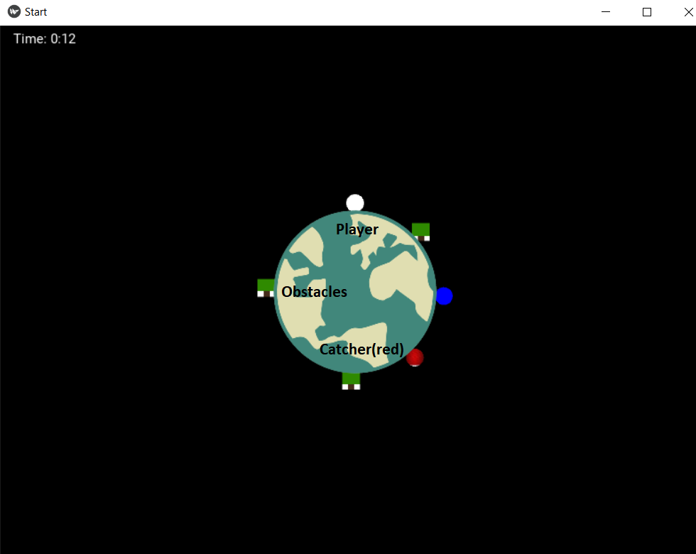

# DW GAME: CATCH!

## Introduction:
### The purpose of this game is similar to catching and trying to avoid getting caught by the chaser as well as avoiding obstacles by moving left, right and/or jumping. There is also a 2 Player mode where another person can control the catcher to try and catch you.

## Game Structure & Instructions

1. Entrance Screen
2. Game Screen
3. End Screen

### Objective:
The objective of the game last as long as possible without being catched by the catcher or colliding with the obstacles.



### Instrucions:

On entering you would see a screen and two buttons giving you the choice of a single player or double player mode.

upon selection, the game will commence accoding to your selection.
The keys required for the player are W to move left ,A to move right & D to jump. Should the second player mode be chosen, J and L are controls for the chaser.

Once you lose, the end screen will appear giving you the choice to play again or end game.

## Coding Structure
The game uses kivy and which is a GUI for python. The game made used of Kivy Widgets, Clock, Buttons, Labels as well as the Kivy Screen Manager.
 
### Classes
There are 6 Main classes used in this code. 5 of which are subclasses of the Kivy Widgets and 1 of which is a subclass of the Kivy Screens.
    
1. Start(App)
    * This is the main class. It inherits from The App class in Kivy.
    * It returns the screen manager which contains all the 3 screens

2. Time (Widget)
    * To keep track of the time the player lasted.

3. Player (Widget)
    * This displays the entity of the Player and changes according to the keys pressed.

4. Chaser (Widget)
    * This displays the entity of the Chaser and changes according to the keys pressed.

5. Earth (Widget)
    This displays the entity of the Earth uses "Rotate" method from Kivy to display the rotating Earth when keys are pressed

6. PlayScreen (Screen)
    * It is the main Screen used to host the widgets of the entities in the game for single player.

7. PlayDouble (Screen)
    *It is the main Screen used to host the widgets of the entities in the game for dual player.

8. OpenScreen (Sreen)
    * It is the Entrance Screen where 2 buttons will be displayed
    * Players will have the option to chose between single Player or Dual Player mode.

9. End (Screen) 
    * Game screen used to host the widgets of the entities in the game.
    

### Methods and Functions

* ### Kivy Screens
    * There are 3 screens in this game. The Entrance, Game & and end Screen. The transition of 1 screen to another is triggered by events such as a press of a button or upon you losing the game.


* ### Kivy Widgets 
    * Each entity in these game for example, the earth, the player, the chaser and the obstacles are made using widgets.


* ### Kivy Buttons
    * The usage of buttons from kivy allows the user to navigate from 1 screen to another. By binding each button with their respective call backs, events can be triggered with the activation of the button to change screen for example. 


    ``` python

    self.button_single = Button(text = "Single Player", font_size = 20, size_hint = (0.2,0.1), pos = self.b1_pos)
        self.button_single.bind(on_release = self.change_screen_single)

    def change_screen_single(self,instance):
        print("Let's Play Single!")
        app.sm.current = "playsingle"
        Clock.schedule_interval(app.update, 0)

    ```


    * In the example below the button appears on the entrance screen. The button is binded to the event on_release. Upon the event, the call back function change_screen is executed which changes the screen to the game screeen and activates the Kivy Clock.


* ### Kivy Clock
    ```python
    Clock.schedule_interval(app.update,0)
    ```
    * This function takes in two arguments. First argument is the call back function and the second argument is the frequency the call back is executedFor example if the value is 0.5 the call_back will be executed every 0.5 seconds. In this case I have left it 0 so that the call back frequency will be every frame.


* ### Movement of Widgets
    * The movement of widgets are controlled based on the keys pressed. The coordinates of the widgets are ( r(cos(angle)) , (r(sin(angle)). This is such that by varying the angle, the widgets will move in a circular motion. Upon pressing the keys on the keyboard, this angle increases and decreases accordingly.

    ```python
    def move(self,dt,key):
            
            step_size = dt*100
        
            if "j" in key:
                self.angle += step_size*2
            
            if "l" in key:
                self.angle -= step_size*2

            if "d" in key:    
                self.angle -= step_size
                
            if "a" in key:    
                self.angle += step_size

            self.obj_pos_x = self.origin[0] + 100*np.sin(((90+self.angle)/180)*np.pi) - (self.obj_size_x/2)
            self.obj_pos_y = self.origin[1] + 100*np.cos(((90+self.angle)/180)*np.pi) - (self.obj_size_y/2)
            self.obj.pos = (self.obj_pos_x, self.obj_pos_y)
            self.center = (self.obj.pos[0] + self.obj_size[0]/2, self.obj.pos[1] + self.obj_size[1]/2)
    ```
    * Above shows the move functtion which takes in 2 variables which are dt and key. The argument dt is the change in time between every frame which is obtained from the Clock function in Kivy. The second argument is key which a python set containing the keys being pressed at the moment.

* ### Automated Movement of Chaser in Single Player Mode
    * There is a need to automate the movement of the chaser for the single player mode thus I used a simple algorithm to move the chaser. The algorithm below is such that the chaser will move towards the player depending on which direction is closer. 
    ```python
    def move(self,dt,key): #makes chaser chase after player automatically
        step_size = dt*100
        angle = 0
        
        if "d" in key:    
            self.angle -= step_size
            
        if "a" in key:    
            self.angle += step_size

        if self.angle >= 360:
            angle = self.angle%360
        elif -360 <= self.angle < 0:
            angle = self.angle+360
        elif angle < -360:
            angle = self.angle%360
        else:
            angle = self.angle
        
        if 90< angle <270:
            self.angle += step_size*0.95
        if 0 < angle <90 or 270 < self.angle%360 < 360:
            self.angle -=step_size*0.95

        self.obj_pos_x = self.origin[0] + 100*np.sin(((90+self.angle)/180)*np.pi) - (self.obj_size_x/2)
        self.obj_pos_y = self.origin[1] + 100*np.cos(((90+self.angle)/180)*np.pi) - (self.obj_size_y/2)
        self.obj.pos = (self.obj_pos_x, self.obj_pos_y)
        self.center = (self.obj.pos[0] + self.obj_size[0]/2, self.obj.pos[1] + self.obj_size[1]/2)
    ```

### Collision Detection
* Collision detection is used to detect if the player has collide with either the obstacles or the chaser. Both scenarios will lead to the game ending. The function for collision detection is shown below

    ```python
    def collide(self, c1, c2):
            dx = c1.center[0] - c2.center[0]
            dy = c1.center[1] - c2.center[1]
            d = (dx**2 + dy**2)**0.5
            r_total = c1.obj_size[0]/2 + c2.obj_size[0]/2
            if d < r_total:
                print(c1.name + " collided with " + c2.name)
                return True
    ```

* The function takes in 2 arguments which are the 2 widgets or entities and returns True if the two entities are touching each other. dx is the difference x coordinates of the centre of the 2 entities and dy is for the y coordinates. d is the distance between the 2 centres of the 2 entities.  

## Future Improvements

There are certainly several improvements that can be done to improve this code some of which are listed below.

* Chasing Algorithm
    * The chasing algoritm can certainly be be better such that the chase is not so monotonous by introducing sudden change in directions. 
* More Features
    * More features as "power ups" that can be collected to speed up or slow down the player upon collecting it can be introduced to make the game more interesting.
* Dual Screen for Double Player Mode
    * A speaparate screen can also be include so that the second player who is the chaser can have a better orientation of his or her movement.  The current game is fixed to orientate towards the Runner and not the chaser
